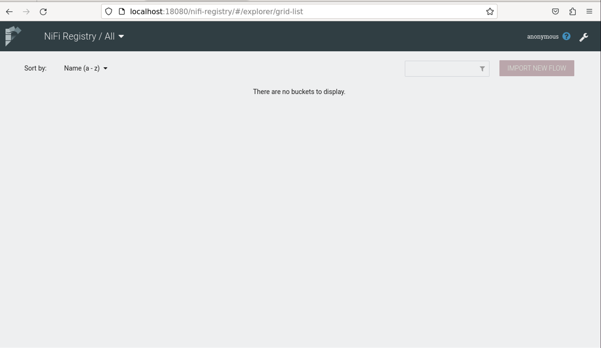

# Running NiFI Registry insecurely


#### Download tarball from Apache NiFi Registry site

```shell
wget https://archive.apache.org/dist/nifi/1.15.3/nifi-registry-1.15.3-bin.tar.gz
tar -zxf nifi-registry-1.15.3-bin.tar.gz
mv nifi-registry-1.15.3 nifi-registry
cd nifi-registry

# start nifi
./bin/nifi-registry.sh start
```

`Note:` We are not required to make any changes in nifi-registry.properties for running it insecurely


#### Navigate to canvas

`https://<ip-address>:18080/nifi-registry`


