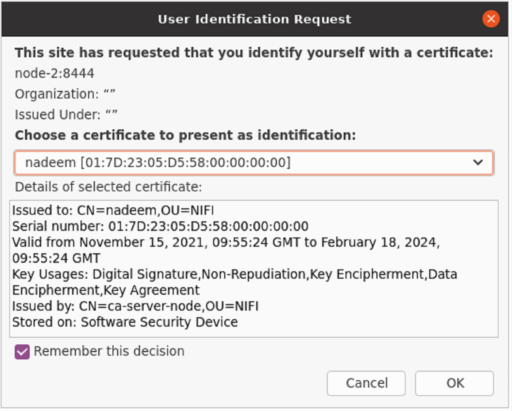
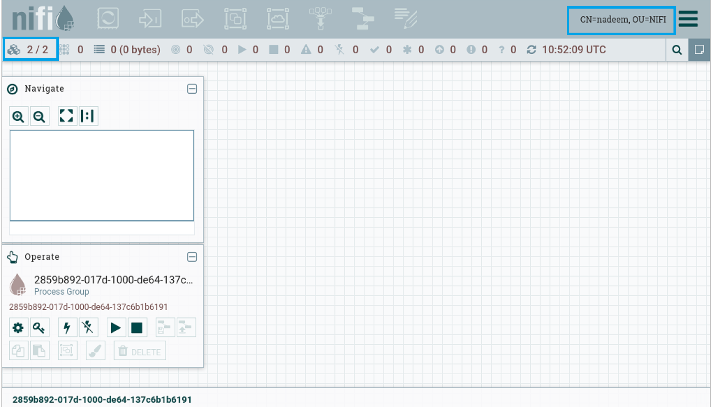
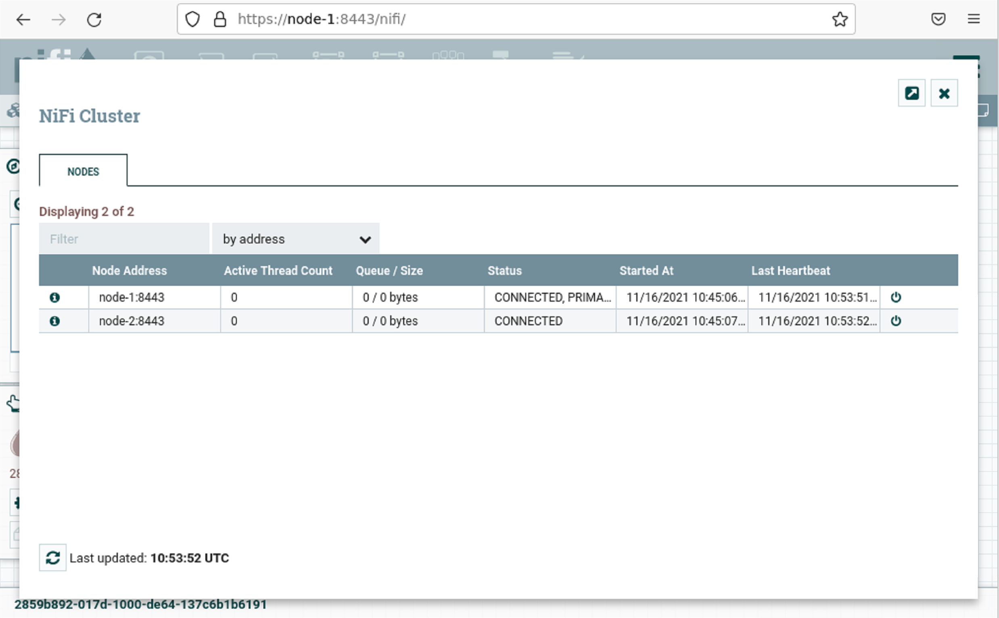

# Running NiFi cluster of two nodes securely

Following pre-requisite is required before running the stack
- Install [docker](https://docs.docker.com/engine/install/) and [docker-compose](https://docs.docker.com/compose/install/)

#### Running `ls`

```
├── CN=nadeem, OU=NIFi
├── node-1
├── node-2
├── authorizers.xml
└── docker-compose.yml
```

#### Start NiFi nodes

```shell
docker-compose up
```

#### Import certificate to browser
Mozilla Firefox -> Settings -> Privacy & Security section -> Certificates (view certificates)

Import `nifi-cert.pem` (CA certificate) and copy `keyStorePassword` from config.json (password of the certificate generated)

#### Navigate to canvas of any node

Node 1: `https://node-1:8443/nifi`, Node 2: `http://node-2:8444/nifi`

Accept user certificate







