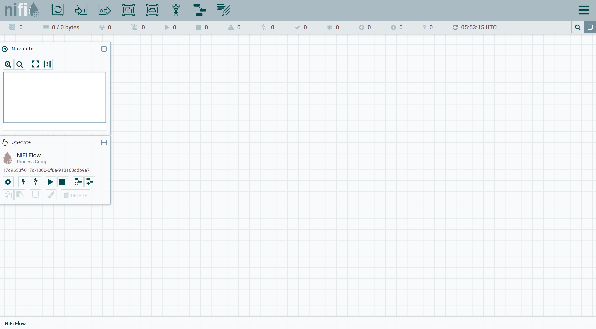

# Running NiFi  insecurely

Following pre-requisite is required before running the stack
- Install [docker](https://docs.docker.com/engine/install/) and [docker-compose](https://docs.docker.com/compose/install/)

#### Start NiFi nodes

```shell
docker-compose up
```

#### Navigate to canvas

`http://<ip-address>:8080/nifi`


