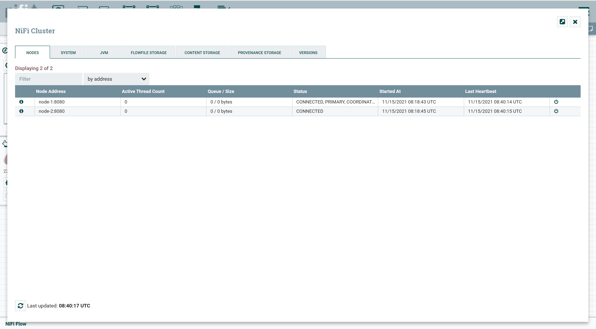

# Running NiFi cluster of two nodes insecurely

By default, NiFi runs securely (from 1.14.0 onwards). In order to run insecurely in embedded zookeeper cluster mode, we have to make following changes

### Download tarball from Apache NiFi site

```shell
wget https://archive.apache.org/dist/nifi/1.21.0/nifi-1.21.0-bin.zip
unzip nifi-1.21.0-bin.zip
cp -R nifi-1.21.0 node-1
cp -R nifi-1.21.0 node-2
```

### Alias /etc/hosts file

Since I'm using using single machine for representing a NiFi nodes as cluster, we need to add them for communication between each othe virtually on the same host (127.0.0.1).

```shell
sudo vi /etc/hosts

# add below entries
127.0.0.1 node-1
127.0.0.1 node-2
```

### Edit nifi.properties file

#### Node 1

```shell
vi conf/nifi.properties

# State Management
nifi.state.management.embedded.zookeeper.start=true


# Site to Site properties
nifi.remote.input.secure=false
nifi.remote.input.http.enabled=true

# web properties #
nifi.web.http.host=node-1   # <ip-address or hostname>
nifi.web.http.port=8081

nifi.web.https.host=
nifi.web.https.port=

# security properties #
nifi.sensitive.props.key=awesome_nifi

nifi.security.keystore=
nifi.security.keystoreType=
nifi.security.truststore=
nifi.security.truststoreType=
nifi.security.user.authorizer=
nifi.security.user.login.identity.provider=

# cluster node properties
nifi.cluster.is.node=true
nifi.cluster.node.address=node-1   # <ip-address or hostname>
nifi.cluster.node.protocol.port=9997

# cluster load balancing properties #
nifi.cluster.load.balance.host=node-1
nifi.cluster.load.balance.port=6342

# zookeeper properties
nifi.zookeeper.connect.string=node-1:2181
```

#### Node 2

```shell
vi conf/nifi.properties

# Site to Site properties
nifi.remote.input.secure=false
nifi.remote.input.http.enabled=true

# web properties #
nifi.web.http.host=node-2   # <ip-address or hostname>
nifi.web.http.port=8082

nifi.web.https.host=
nifi.web.https.port=

# security properties #
nifi.sensitive.props.key=awesome_nifi

nifi.security.keystore=
nifi.security.keystoreType=
nifi.security.truststore=
nifi.security.truststoreType=
nifi.security.user.authorizer=
nifi.security.user.login.identity.provider=

# cluster node properties
nifi.cluster.is.node=true
nifi.cluster.node.address=node-2   # <ip-address or hostname>
nifi.cluster.node.protocol.port=9998

# cluster load balancing properties #
nifi.cluster.load.balance.host=node-2
nifi.cluster.load.balance.port=6343

# zookeeper properties
nifi.zookeeper.connect.string=node-1:2181,node-2:2181
```

### Edit state-management.xml file

Perform below step for each node

```xml
vi conf/state-management.xml

<!-- edit <cluster-provider> with <id>zk-provider</id> to look like below -->

<cluster-provider>
    <id>zk-provider</id>
    <class>org.apache.nifi.controller.state.providers.zookeeper.ZooKeeperStateProvider</class>
    <property name="Connect String">node-1:2181</property>
    <property name="Root Node">/nifi</property>
    <property name="Session Timeout">10 seconds</property>
    <property name="Access Control">Open</property>
</cluster-provider>
```

### Edit zookeeper.properties file

Perform below step for node-1 since its running a embedded zookeeper. This is needed to uniquely identify list of embedded zookeepers running

```shell
vi conf/zookeeper.properties

# add below entries
server.1=node-1:2888:3888;2181
```

### Add zookeeper node identities

By default, `dataDir` property in `state-management.xml` is kept to `./state/zookeeper`. If more than one NiFi node is running an embedded zookeeper, it is important to tell server which one it is.

Since, we have running embedded zookeeper only in node-1, we need to execute following

#### Node 1

```shell
echo 1 > ./state/zookeeper/myid
```

### Start NiFi on each node

```shell
cd nifi/bin
./nifi.sh start
```

### Navigate to canvas of any node

`http://node-1:8081/nifi`, `http://node-2:8082/nifi`



