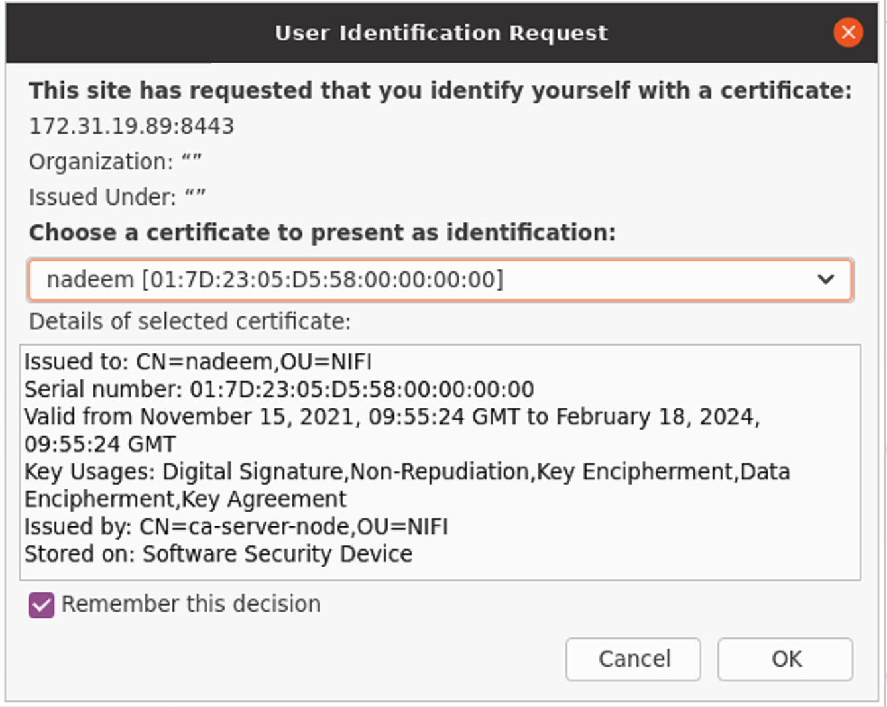
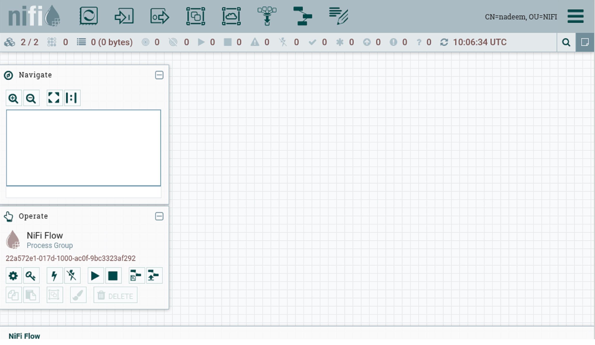
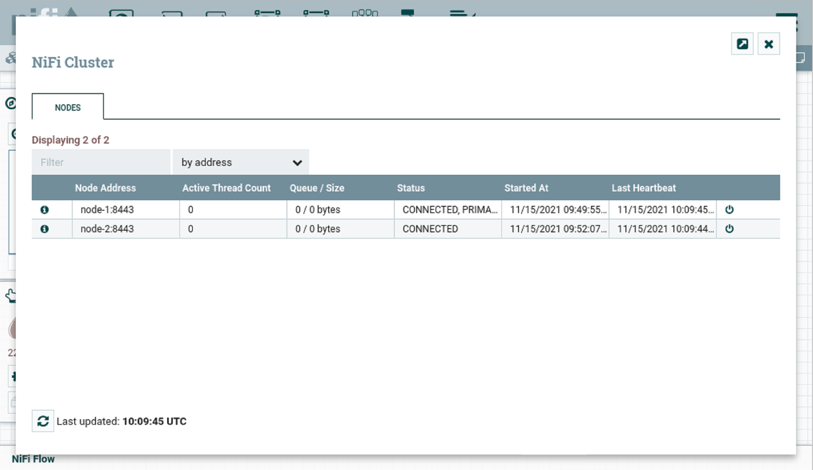

# Running NiFi cluster of two nodes securely

By default, NiFi runs securely (from 1.14.0 onwards). In order to run cluster securely with embedded zookeeper, we have to make following changes

### Download tarball from Apache NiFi site

```shell
wget https://archive.apache.org/dist/nifi/1.21.0/nifi-1.21.0-bin.zip
unzip nifi-1.21.0-bin.zip
cp -R nifi-1.21.0 node-1
cp -R nifi-1.21.0 node-2
```

### Download NiFi Toolkit tarball from Apache NiFi site

NiFi Toolkit is helpful to automatically generate the required keystores, truststore and relevant configuration files. This is especially useful for securing multiple NiFi nodes, which can be tedious and error-prone process.

```shell
wget https://archive.apache.org/dist/nifi/1.21.0/nifi-toolkit-1.21.0-bin.zip
unzip nifi-toolkit-1.21.0-bin.zip
mv nifi-toolkit-1.21.0 nifi-toolkit
```

### Alias /etc/hosts file

Since I'm using using single machine for representing a NiFi nodes as cluster, we need to add them for communication between each othe vitually on the same host (127.0.0.1).

```shell
sudo vi /etc/hosts

# add below entries
127.0.0.1 node-1
127.0.0.1 node-2
127.0.0.1 ca-server-node
```

### Running NiFi Toolkit in Server mode

In cluster setup, nodes need to communicate with each other for sharing flow configurations, state etc. In secure environment, each node much connect securely via TLS present certifcate as authentication mechanism. So, for a node to trust another node, it should have certifcate signed by same CA (certificate authority)

```shell
cd nifi-toolkit

# running in server mode
./bin/tls-toolkit.sh client -c ca-server-node -t mytokenfornificourse -p 9999 -D "CN=nadeem,OU=NIFI" -T PKCS12
```

### Running NiFi Toolkit in client mode for generating keystore, truststore

#### Node 1

```shell
mkdir node-1
cd node-1

# generate keystore, truststore
./bin/tls-toolkit.sh client -c ca-server-node -t mytokenfornificourse -D "CN=node-1,OU=NIFI" -p 9999 --subjectAlternativeNames "localhost,node-1"

```

Running `ls node-1` would result in below structure

```
├── config.json
├── keystore.jks
├── truststore.jks
├── nifi-cert.pem
```

Move keystore, truststore to `nifi/certs` directory

```shell
mkdir nifi/certs
cp node-1/* nifi/certs
```

#### Node 2

```shell
mkdir node-2
cd node-2

# generate keystore, truststore
./bin/tls-toolkit.sh client -c ca-server-node -t mytokenfornificourse -D "CN=node-2,OU=NIFI" -p 9999 --subjectAlternativeNames "localhost,node-2"

```

Running `ls node-2` would result in below structure

```
├── config.json
├── keystore.jks
├── truststore.jks
├── nifi-cert.pem
```

Move keystore, truststore to `nifi/certs` directory

```shell
mkdir nifi/certs
cp node-2/* nifi/certs
```

### Edit nifi.properties file

#### Node 1

```shell
vi conf/nifi.properties

# State Management
nifi.state.management.embedded.zookeeper.start=true


# Site to Site properties
nifi.remote.input.secure=true
nifi.remote.input.http.enabled=true

# web properties #
nifi.web.http.host=
nifi.web.http.port=

nifi.web.https.host=node-1
nifi.web.https.port=8443

# security properties #
nifi.sensitive.props.key=awesome_nifi

nifi.security.keystore=./certs/keystore.jks
nifi.security.keystoreType=jks
# copy keyStorePassword from certs/config.json file
nifi.security.keystorePasswd=eU5dA1mkmicAi6LaUgj6BiiXpHoh2l3EZ2SId5EmNCM
# copy keyPassword" from certs/config.json file
nifi.security.keyPasswd=eU5dA1mkmicAi6LaUgj6BiiXpHoh2l3EZ2SId5EmNCM
nifi.security.truststore=./certs/truststore.jks
nifi.security.truststoreType=jks
# copy trustStorePassword from certs/config.json file
nifi.security.truststorePasswd=N0JKy78/Uv971N3T0WMIDxOFqea9QL7LEtHJOKIvWJk
nifi.security.user.authorizer=managed-authorizer
nifi.security.allow.anonymous.authentication=false

# comment below property
#nifi.security.user.login.identity.provider=single-user-provider

# cluster node properties
nifi.cluster.protocol.is.secure=true


# cluster node properties
nifi.cluster.is.node=true
nifi.cluster.node.address=node-1
nifi.cluster.node.protocol.port=9997

# cluster load balancing properties
nifi.cluster.load.balance.host=node-1
nifi.cluster.load.balance.port=6342

# zookeeper properties
nifi.zookeeper.connect.string=node-1:2181
```

#### Node 2

```shell
vi conf/nifi.properties

# Site to Site properties
nifi.remote.input.secure=true
nifi.remote.input.http.enabled=true

# web properties #
nifi.web.http.host=
nifi.web.http.port=

nifi.web.https.host=node-2
nifi.web.https.port=8444

# security properties #
nifi.sensitive.props.key=awesome_nifi

nifi.security.keystore=./certs/keystore.jks
nifi.security.keystoreType=jks
# copy keyStorePassword from certs/config.json file
nifi.security.keystorePasswd=Gux5aZZHYmoEwQfjxo0Yop31gUvi+1FSLfpcakxKBGI
# copy keyPassword" from certs/config.json file
nifi.security.keyPasswd=Gux5aZZHYmoEwQfjxo0Yop31gUvi+1FSLfpcakxKBGI
nifi.security.truststore=./certs/truststore.jks
nifi.security.truststoreType=jks
# copy trustStorePassword from certs/config.json file
nifi.security.truststorePasswd=QloPLFouiHi+XZYpJYwNeJP1mp5d0sXqsARa/vRJQSE
nifi.security.user.authorizer=managed-authorizer
nifi.security.allow.anonymous.authentication=false

# comment below property
#nifi.security.user.login.identity.provider=single-user-provider

# cluster node properties
nifi.cluster.protocol.is.secure=true


# cluster node properties
nifi.cluster.is.node=true
nifi.cluster.node.address=node-2
nifi.cluster.node.protocol.port=9998

# cluster load balancing properties
nifi.cluster.load.balance.host=node-2
nifi.cluster.load.balance.port=6343

# zookeeper properties
nifi.zookeeper.connect.string=node-1:2181
```

### Edit state-management.xml file

Perform below step for each node

```xml
vi conf/state-management.xml

<!-- edit <cluster-provider> with <id>zk-provider</id> to look like below -->

<cluster-provider>
    <id>zk-provider</id>
    <class>org.apache.nifi.controller.state.providers.zookeeper.ZooKeeperStateProvider</class>
    <property name="Connect String">node-1:2181</property>
    <property name="Root Node">/nifi</property>
    <property name="Session Timeout">10 seconds</property>
    <property name="Access Control">Open</property>
</cluster-provider>
```

### Edit authorizers.xml file

Perform below step for each node

```xml
<!-- edit <userGroupProvider> section to look like below -->

<userGroupProvider>
    <identifier>file-user-group-provider</identifier>
    <class>org.apache.nifi.authorization.FileUserGroupProvider</class>
    <property name="Users File">./conf/users.xml</property>
    <property name="Legacy Authorized Users File"></property>

    <property name="Initial User Identity 1">CN=nadeem, OU=NIFI</property>
    <property name="Initial User Identity 2">CN=node-1, OU=NIFI</property>
    <property name="Initial User Identity 3">CN=node-2, OU=NIFI</property>
</userGroupProvider>

<!-- edit <accessPolicyProvider> section to look like below -->

<accessPolicyProvider>
    <identifier>file-access-policy-provider</identifier>
    <class>org.apache.nifi.authorization.FileAccessPolicyProvider</class>
    <property name="User Group Provider">file-user-group-provider</property>
    <property name="Authorizations File">./conf/authorizations.xml</property>
    <property name="Initial Admin Identity">CN=nadeem, OU=NIFI</property>
    <property name="Legacy Authorized Users File"></property>
    <property name="Node Identity 1">CN=node-1, OU=NIFI</property>
    <property name="Node Identity 1">CN=node-2, OU=NIFI</property>
    <property name="Node Group"></property>
</accessPolicyProvider>

<!-- comment single user authorizer <authorizers> section-->

<!--<authorizer>
    <identifier>single-user-authorizer</identifier>
    <class>org.apache.nifi.authorization.single.user.SingleUserAuthorizer</class>
</authorizer>-->
```

### Edit zookeeper.properties file

Perform below step for node-1 since its running a embedded zookeeper. This is needed to uniquely identify list of embedded zookeepers running

```shell
vi conf/zookeeper.properties

# add below entries
server.1=node-1:2888:3888;2181
```

### Add zookeeper node identities

By default, `dataDir` property in `state-management.xml` is kept to `./state/zookeeper`. If more than one NiFi node is running an embedded zookeeper, it is important to tell server which one it is.

#### Node 1

```shell
echo 1 > ./state/zookeeper/myid
```

### Start NiFi on each node

```shell
cd nifi/bin
./nifi.sh start
```

### Importing user certificate to browser

#### Generate user certificate

```shell
mkdir nadeem
# get certificate signed from long running ca server (nifi-toolkit in server mode)
./bin/tls-toolkit.sh client -c ca-server-node -t mytokenfornificourse -p 9999 -D "CN=nadeem,OU=NIFI" -T PKCS12
```

Running `ls nadeem` would result in below structure

```
├── config.json
├── keystore.jks
├── truststore.jks
├── nifi-cert.pem
```

#### Import certificate to browser

Mozilla Firefox -> Settings -> Privacy & Security section -> Certificates (view certificates)

Import `nifi-cert.pem` (CA certificate) and copy `keyStorePassword` from config.json (password of the certificate generated)

### Navigate to canvas of any node

`https://node-1:8443/nifi`, `https://node-2:8444/nifi`

Accept user certificate






