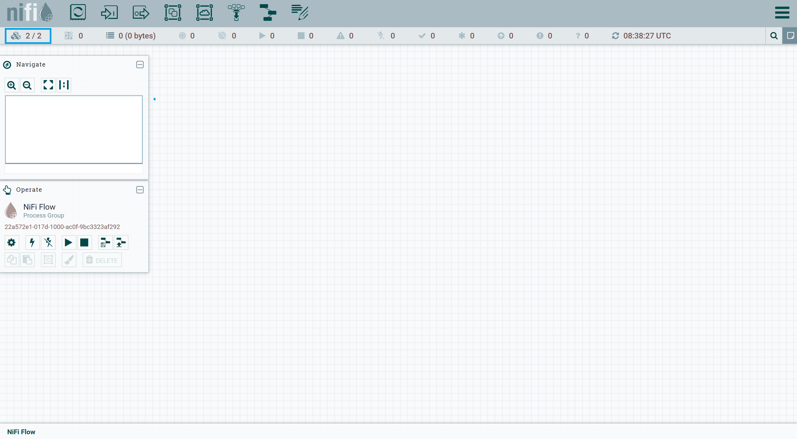

# Running NiFi cluster of two nodes insecurely

By default, NiFi runs securely (from 1.14.0 onwards). In order to run cluster insecurely with external zookeeper, we have to make following changes.

### Download tarball from Apache NiFi site

```shell
wget https://archive.apache.org/dist/nifi/1.21.0/nifi-1.21.0-bin.zip
unzip nifi-1.21.0-bin.zip
cp -R nifi-1.21.0 node-1
cp -R nifi-1.21.0 node-2
```

### Download Zookeeper tarball

Since we will be running zookeeper externally, we are required to install it separately.

```shell
wget https://archive.apache.org/dist/zookeeper/zookeeper-3.7.1/apache-zookeeper-3.7.1-bin.tar.gz
tar -zxf apache-zookeeper-3.7.1-bin.tar.gz
mv apache-zookeeper-3.7.1-bin zookeeper
```

### Alias /etc/hosts file

Since I'm using using single machine for representing a NiFi nodes as cluster, we need to add them for communication between each othe virtually on the same host (127.0.0.1). Also, we are running external zookeeper with host `zookeeper-node`

```shell
sudo vi /etc/hosts

# add below entries
127.0.0.1 node-1
127.0.0.1 node-2
127.0.0.1 zookeeper-node
```

### Starting Zookeeper

```shell
cd zookeeper

# configure zookeeper properties
cp conf/zoo_sample.cfg conf zoo.cfg

# start zookeeper
./bin/zkServer.sh start
```

### Edit nifi.properties file

#### Node 1

```shell
vi conf/nifi.properties

# Site to Site properties
nifi.remote.input.secure=false
nifi.remote.input.http.enabled=true

# web properties #
nifi.web.http.host=node-1   # <ip-address or hostname>
nifi.web.http.port=8081

nifi.web.https.host=
nifi.web.https.port=

# security properties #
nifi.sensitive.props.key=awesome_nifi

nifi.security.keystore=
nifi.security.keystoreType=
nifi.security.truststore=
nifi.security.truststoreType=
nifi.security.user.authorizer=
nifi.security.user.login.identity.provider=

# cluster node properties
nifi.cluster.is.node=true
nifi.cluster.node.address=node-1   # <ip-address or hostname>
nifi.cluster.node.protocol.port=9997

# cluster load balancing properties #
nifi.cluster.load.balance.host=node-1
nifi.cluster.load.balance.port=6342

# zookeeper properties
nifi.zookeeper.connect.string=zookeeper-node:2181
```

#### Node 2

```shell
vi conf/nifi.properties

# Site to Site properties
nifi.remote.input.secure=false
nifi.remote.input.http.enabled=true

# web properties #
nifi.web.http.host=node-2   # <ip-address or hostname>
nifi.web.http.port=8082

nifi.web.https.host=
nifi.web.https.port=

# security properties #
nifi.sensitive.props.key=awesome_nifi

nifi.security.keystore=
nifi.security.keystoreType=
nifi.security.truststore=
nifi.security.truststoreType=
nifi.security.user.authorizer=
nifi.security.user.login.identity.provider=

# cluster node properties
nifi.cluster.is.node=true
nifi.cluster.node.address=node-2   # <ip-address or hostname>
nifi.cluster.node.protocol.port=9998

# cluster load balancing properties #
nifi.cluster.load.balance.host=node-2
nifi.cluster.load.balance.port=6343

# zookeeper properties
nifi.zookeeper.connect.string=zookeeper-node:2181
```

### Edit state-management.xml file

Perform below step for each node

```xml
vi conf/state-management.xml

<!-- edit <cluster-provider> with <id>zk-provider</id> to look like below -->

<cluster-provider>
    <id>zk-provider</id>
    <class>org.apache.nifi.controller.state.providers.zookeeper.ZooKeeperStateProvider</class>
    <property name="Connect String">zookeeper-node:2181</property>
    <property name="Root Node">/nifi</property>
    <property name="Session Timeout">10 seconds</property>
    <property name="Access Control">Open</property>
</cluster-provider>
```

### Start NiFi on each node

```shell
cd nifi/bin
./nifi.sh start
```

### Navigate to canvas of any node

`http://node-1:8081/nifi`, `http://node-2:8082/nifi`




