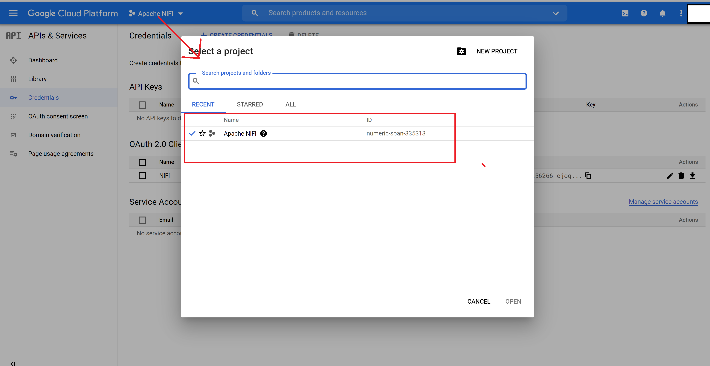
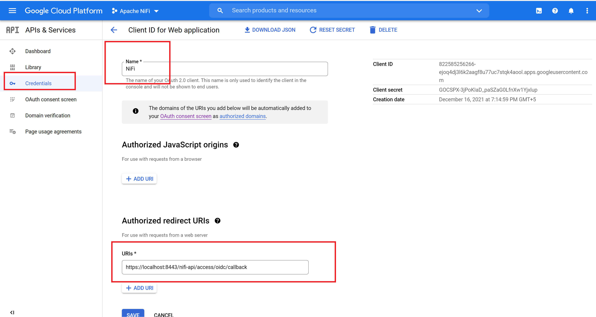
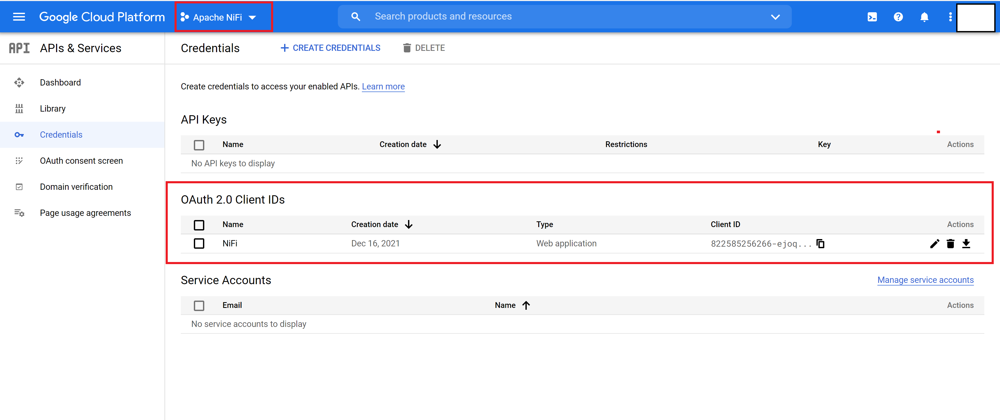
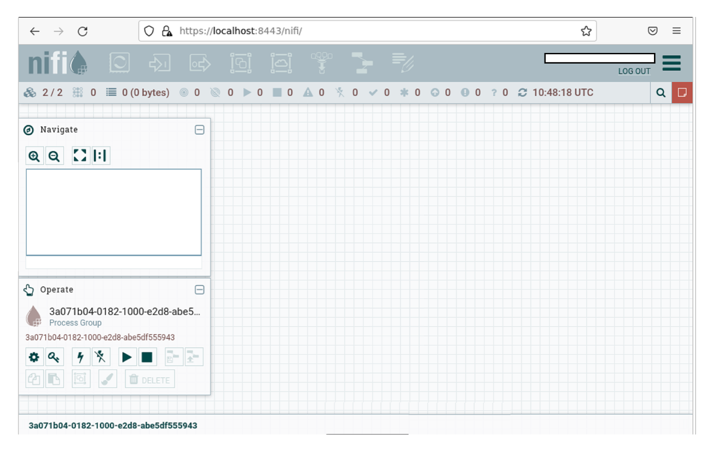
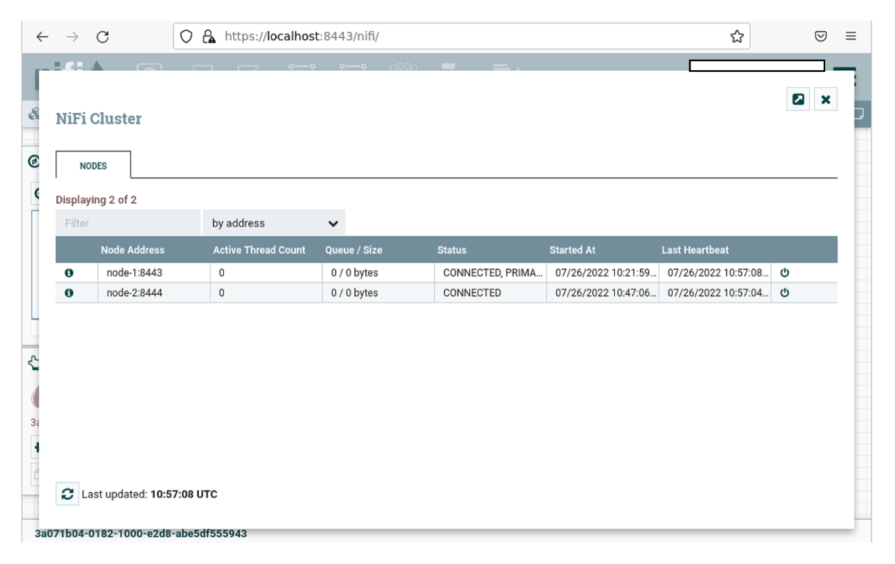

# Running NiFi cluster of two nodes securely with OpenID Connect

By default, NiFi runs securely (from 1.14.0 onwards). In order to run cluster securely with external zookeeper with OpenID Connect, we have to make following changes

### Download tarball from Apache NiFi site

```shell
wget https://archive.apache.org/dist/nifi/1.21.0/nifi-1.21.0-bin.zip
unzip nifi-1.21.0-bin.zip
cp -R nifi-1.21.0 node-1
cp -R nifi-1.21.0 node-2
```

### Download NiFi Toolkit tarball from Apache NiFi site

NiFi Toolkit is helpful to automatically generate the required keystores, truststore and relevant configuration files. This is especially useful for securing multiple NiFi nodes, which can be tedious and error-prone process.

```shell
wget https://archive.apache.org/dist/nifi/1.21.0/nifi-toolkit-1.21.0-bin.zip
unzip nifi-toolkit-1.21.0-bin.zip
mv nifi-toolkit-1.21.0 nifi-toolkit
```

### Download Zookeeper tarball

Since we will be running zookeeper externally, we are required to install it separately.

```shell
wget https://archive.apache.org/dist/zookeeper/zookeeper-3.7.1/apache-zookeeper-3.7.1-bin.tar.gz
tar -zxf apache-zookeeper-3.7.1-bin.tar.gz
mv apache-zookeeper-3.7.1-bin zookeeper
```

### Alias /etc/hosts file

Since I'm using using single machine for representing a NiFi nodes as cluster, we need to add them for communication between each othe virtually on the same host (127.0.0.1). Also, we are running external zookeeper with host `zookeeper-node`

```shell
sudo vi /etc/hosts

# add below entries
127.0.0.1 node-1
127.0.0.1 node-2
127.0.0.1 ca-server-node
127.0.0.1 zookeeper-node
```

### Starting Zookeeper

```shell
cd zookeeper

# configure zookeeper properties
cp conf/zoo_sample.cfg conf zoo.cfg

# start zookeeper
./bin/zkServer.sh start
```

### Running NiFi Toolkit in Server mode

In cluster setup, nodes need to communicate with each other for sharing flow configurations, state etc. In secure environment, each node much connect securely via TLS present certifcate as authentication mechanism. So, for a node to trust another node, it should have certifcate signed by same CA (certificate authority)

```shell
cd nifi-toolkit

# running in server mode
./bin/tls-toolkit.sh server -c ca-server-node -t mytokenfornificourse -p 9999
```

### Running NiFi Toolkit in client mode for generating keystore, truststore for NiFi nodes

#### Node 1

```shell
# change directory to nifi-toolkit
cd nifi-toolkit

# create directory `cert-node-1`
mkdir cert-node-1

# change directory to cert-node-1
cd cert-node-1

# generate keystore, truststore
../bin/tls-toolkit.sh client -c ca-server-node -t mytokenfornificourse -D "CN=node-1,OU=NIFI" -p 9999 --subjectAlternativeNames "localhost,node-1,node-2"

```

Running `ls node-1` would result in below structure

```
├── config.json
├── keystore.jks
├── truststore.jks
├── nifi-cert.pem
```

Move keystore, truststore to `node-1/certs` directory

```shell
# navigate to node-1 nifi binary and create certs directory
# where all the toolkit generated certificates can be copied
mkdir node-1/certs

cp cert-node-1/* node-1/certs
```

#### Node 2

```shell
# change directory to nifi-toolkit
cd nifi-toolkit

# create directory `cert-node-2`
mkdir cert-node-2

# change directory to cert-node-2
cd cert-node-2

# generate keystore, truststore
../bin/tls-toolkit.sh client -c ca-server-node -t mytokenfornificourse -D "CN=node-2,OU=NIFI" -p 9999 --subjectAlternativeNames "localhost,node-1,node-2"

```

Running `ls node-2` would result in below structure

```
├── config.json
├── keystore.jks
├── truststore.jks
├── nifi-cert.pem
```

Move keystore, truststore to `node-2/certs` directory

```shell
# navigate to node-2 nifi binary and create certs directory
# where all the toolkit generated certificates can be copied
mkdir node-2/certs

cp cert-node-2/* node-2/certs
```

### Create Google API Credentials

- Login to the Google Developers Console with your google account
  https://console.developers.google.com/apis/library

- Choose the "Select Project" option from the top menu
  

- Provide name for the project and configure callback
  

- Copy `client_id` and `client_secret`. We will need this to configure NiFi with Google OIDC

- This is what your OAuth client list looks like
  

### Edit nifi.properties file

#### Node 1

```shell
vi conf/nifi.properties

# Site to Site properties
nifi.remote.input.secure=true
nifi.remote.input.http.enabled=true

# web properties #
nifi.web.http.host=
nifi.web.http.port=

nifi.web.https.host=node-1
nifi.web.https.port=8443

# security properties #
nifi.sensitive.props.key=awesome_nifi

nifi.security.keystore=./certs/keystore.jks
nifi.security.keystoreType=jks
# copy keyStorePassword from node-1/certs/config.json file
nifi.security.keystorePasswd=eU5dA1mkmicAi6LaUgj6BiiXpHoh2l3EZ2SId5EmNCM
# copy keyPassword from node-1/certs/config.json file
nifi.security.keyPasswd=eU5dA1mkmicAi6LaUgj6BiiXpHoh2l3EZ2SId5EmNCM
nifi.security.truststore=./certs/truststore.jks
nifi.security.truststoreType=jks
# copy trustStorePassword from node-1certs/config.json file
nifi.security.truststorePasswd=N0JKy78/Uv971N3T0WMIDxOFqea9QL7LEtHJOKIvWJk
nifi.security.user.authorizer=managed-authorizer
nifi.security.allow.anonymous.authentication=false

# comment below property
#nifi.security.user.login.identity.provider=single-user-provider

# OpenId Connect SSO Properties #
nifi.security.user.oidc.discovery.url=https://accounts.google.com/.well-known/openid-configuration
nifi.security.user.oidc.connect.timeout=5 secs
nifi.security.user.oidc.read.timeout=5 secs
# configure client id and secret.
nifi.security.user.oidc.client.id=<client_id>
nifi.security.user.oidc.client.secret=<client_secret>

# cluster node properties
nifi.cluster.protocol.is.secure=true


# cluster node properties
nifi.cluster.is.node=true
nifi.cluster.node.address=node-1
nifi.cluster.node.protocol.port=9997

# cluster load balancing properties
nifi.cluster.load.balance.host=node-1
nifi.cluster.load.balance.port=6342

# zookeeper properties
nifi.zookeeper.connect.string=zookeeper-node:2181
```

#### Node 2

```shell
vi conf/nifi.properties

# Site to Site properties
nifi.remote.input.secure=true
nifi.remote.input.http.enabled=true

# web properties #
nifi.web.http.host=
nifi.web.http.port=

nifi.web.https.host=node-2
nifi.web.https.port=8444

# security properties #
nifi.sensitive.props.key=awesome_nifi

nifi.security.keystore=./certs/keystore.jks
nifi.security.keystoreType=jks
# copy keyStorePassword from node-2/certs/config.json file
nifi.security.keystorePasswd=Gux5aZZHYmoEwQfjxo0Yop31gUvi+1FSLfpcakxKBGI
# copy keyPassword from node-2/certs/config.json file
nifi.security.keyPasswd=Gux5aZZHYmoEwQfjxo0Yop31gUvi+1FSLfpcakxKBGI
nifi.security.truststore=./certs/truststore.jks
nifi.security.truststoreType=jks
# copy trustStorePassword from node-2/certs/config.json file
nifi.security.truststorePasswd=QloPLFouiHi+XZYpJYwNeJP1mp5d0sXqsARa/vRJQSE
nifi.security.user.authorizer=managed-authorizer
nifi.security.allow.anonymous.authentication=false

# comment below property
#nifi.security.user.login.identity.provider=single-user-provider

# OpenId Connect SSO Properties #
nifi.security.user.oidc.discovery.url=https://accounts.google.com/.well-known/openid-configuration
nifi.security.user.oidc.connect.timeout=5 secs
nifi.security.user.oidc.read.timeout=5 secs
# configure client id and secret.
nifi.security.user.oidc.client.id=<client_id>
nifi.security.user.oidc.client.secret=<client_secret>

# cluster node properties
nifi.cluster.protocol.is.secure=true


# cluster node properties
nifi.cluster.is.node=true
nifi.cluster.node.address=node-2
nifi.cluster.node.protocol.port=9998

# cluster load balancing properties
nifi.cluster.load.balance.host=node-2
nifi.cluster.load.balance.port=6343

# zookeeper properties
nifi.zookeeper.connect.string=zookeeper-node:2181
```

### Edit state-management.xml file

Perform below step for each node

```xml
vi conf/state-management.xml

<!-- edit <cluster-provider> with <id>zk-provider</id> to look like below -->

<cluster-provider>
    <id>zk-provider</id>
    <class>org.apache.nifi.controller.state.providers.zookeeper.ZooKeeperStateProvider</class>
    <property name="Connect String">zookeeper-node:2181</property>
    <property name="Root Node">/nifi</property>
    <property name="Session Timeout">10 seconds</property>
    <property name="Access Control">Open</property>
</cluster-provider>
```

### Edit authorizers.xml file

Adding users, nodes as users and seeding them with admin policies. Perform below step for each node

```xml
<!-- edit <userGroupProvider> section to look like below -->

<userGroupProvider>
    <identifier>file-user-group-provider</identifier>
    <class>org.apache.nifi.authorization.FileUserGroupProvider</class>
    <property name="Users File">./conf/users.xml</property>
    <property name="Legacy Authorized Users File"></property>

    <property name="Initial User Identity 1">test@gmail.com</property>
    <property name="Initial User Identity 2">CN=node-1, OU=NIFI</property>
    <property name="Initial User Identity 3">CN=node-2, OU=NIFI</property>
</userGroupProvider>

<!-- edit <accessPolicyProvider> section to look like below -->

<accessPolicyProvider>
    <identifier>file-access-policy-provider</identifier>
    <class>org.apache.nifi.authorization.FileAccessPolicyProvider</class>
    <property name="User Group Provider">file-user-group-provider</property>
    <property name="Authorizations File">./conf/authorizations.xml</property>
    <property name="Initial Admin Identity">test@gmail.com</property>
    <property name="Legacy Authorized Users File"></property>
    <property name="Node Identity 1">CN=node-1, OU=NIFI</property>
    <property name="Node Identity 1">CN=node-2, OU=NIFI</property>
    <property name="Node Group"></property>
</accessPolicyProvider>
```

### Start NiFi on each node

```shell
cd nifi/bin
./nifi.sh start
```

### Navigate to canvas of any node

`https://node-1:8443/nifi`, `https://node-2:8444/nifi`

`Accept the Risk and Continue` to trust the self-signed ca




