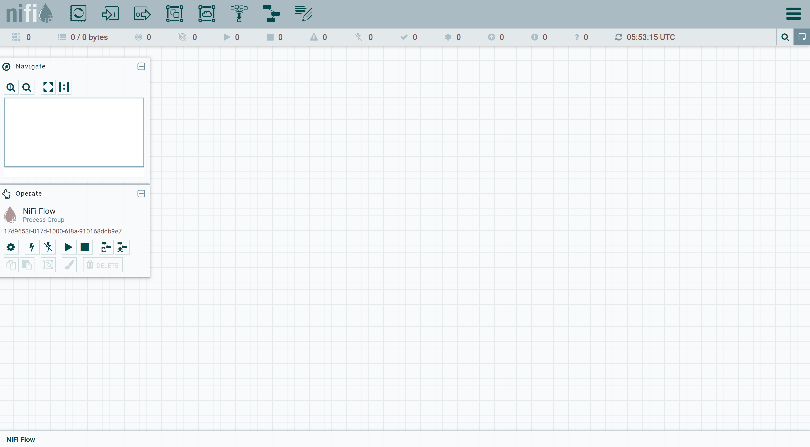

# Running NiFI insecurely

By default, NiFi runs securely (from 1.14.0 onwards). In order to run insecurely, we have to make following changes

#### Download tarball from Apache NiFi site

```shell
wget https://archive.apache.org/dist/nifi/1.21.0/nifi-1.21.0-bin.zip
unzip nifi-1.21.0-bin.zip
mv nifi-1.21.0 nifi
cd nifi
```

#### Edit nifi.properties file

```shell
vi conf/nifi.properties

# Site to Site properties
nifi.remote.input.secure=false
nifi.remote.input.http.enabled=false

# web properties #
nifi.web.http.host=<ip-address>
nifi.web.http.port=8080

nifi.web.https.host=
nifi.web.https.port=

# security properties #
nifi.security.keystore=
nifi.security.keystoreType=
nifi.security.truststore=
nifi.security.truststoreType=
nifi.security.user.authorizer=
nifi.security.user.login.identity.provider=

```

#### Navigate to canvas

`http://<ip-address>:8080/nifi`


