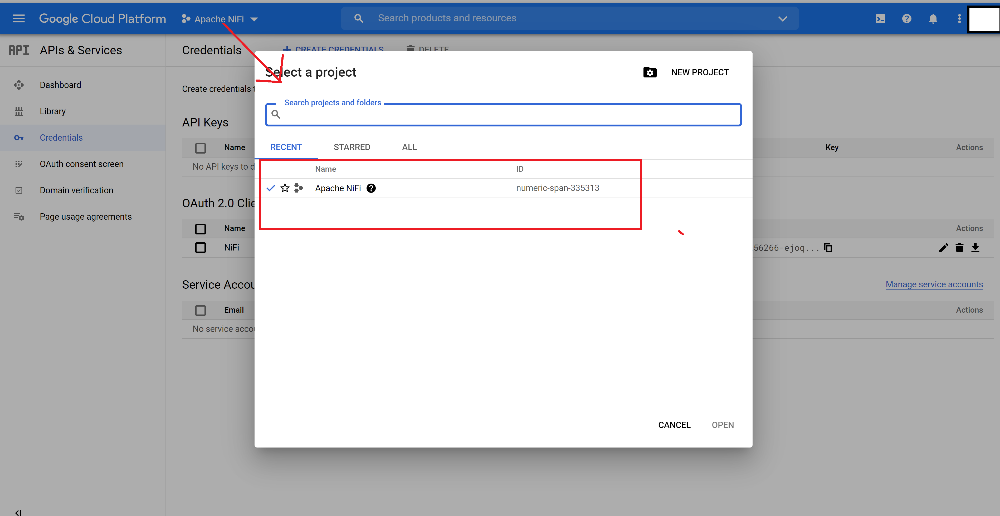
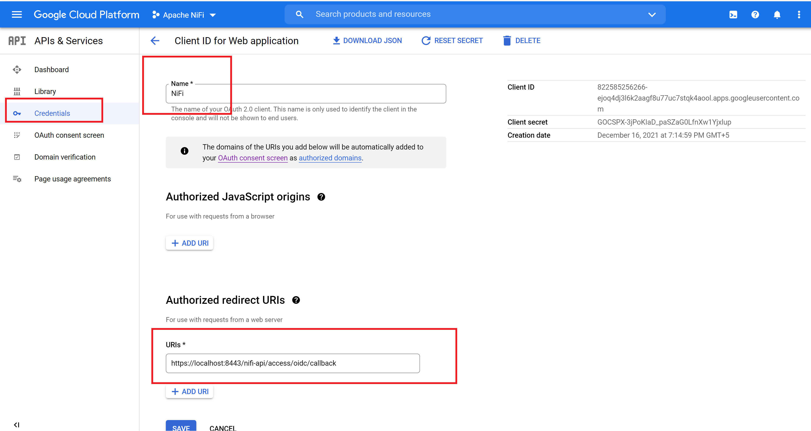
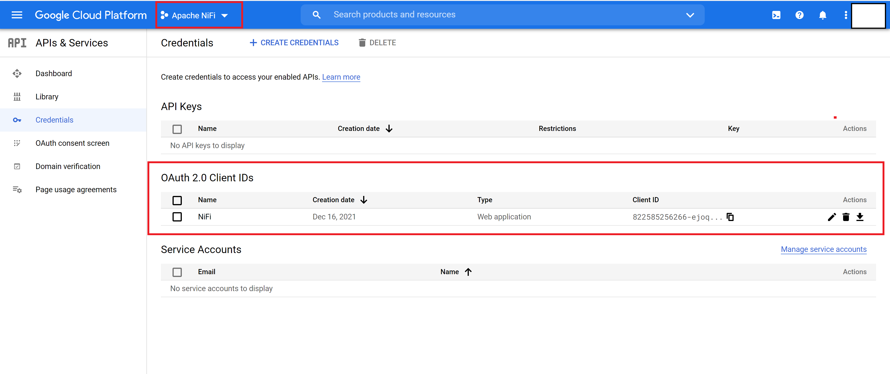
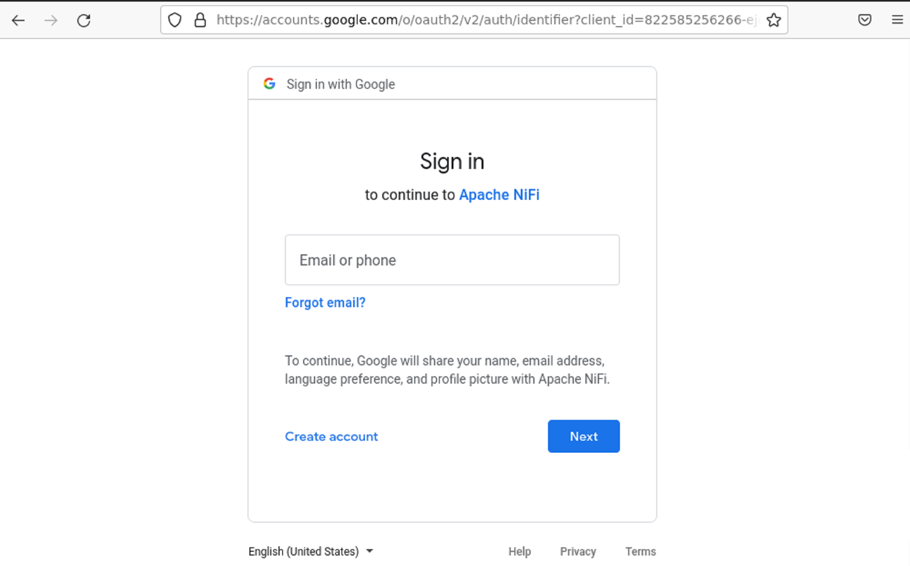
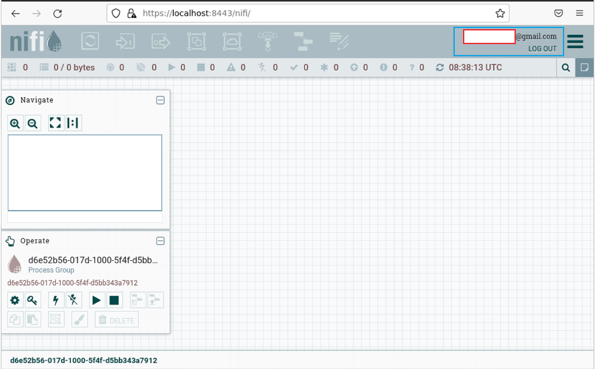

# Running NiFI securely

By default, NiFi runs securely (from 1.14.0 onwards). Following instructions demonstrates openid-connect authentication mechanism. We will use Google OIDC as Identity Provider.

### Download tarball from Apache NiFi site

```shell
wget https://archive.apache.org/dist/nifi/1.21.0/nifi-1.21.0-bin.zip
unzip nifi-1.21.0-bin.zip
mv nifi-1.21.0 nifi
```

### Download NiFi Toolkit tarball from Apache NiFi site

NiFi Toolkit is helpful to automatically generate the required keystores, truststore and relevant configuration files. This is especially useful for securing multiple NiFi nodes, which can be tedious and error-prone process.

```shell
wget https://archive.apache.org/dist/nifi/1.21.0/nifi-toolkit-1.21.0-bin.zip
unzip nifi-toolkit-1.21.0-bin.zip
mv nifi-toolkit-1.21.0 nifi-toolkit
```

### Generating keystore, truststore for server

```shell
cd nifi-toolkit
bin/tls-toolkit.sh standalone -n 'localhost'

```

Running `ls` will result in below structure

```
├── LICENSE
├── NOTICE
├── bin
├── classpath
├── conf
├── lib
├── localhost
├── nifi-cert.pem
└── nifi-key.key
```

### Copy keystore, trustore

```shell
mkdir /home/ubuntu/nifi/certs
cp localhost/keystore.jks /home/ubuntu/nifi/certs/keystore.jks
cp localhost/truststore.jks /home/ubuntu/nifi/certs/truststore.jks

# copy keystore and truststore passwords from localhost/nifi.properties file
```

### Create Google API Credentials

- Login to the Google Developers Console with your google account
  https://console.developers.google.com/apis/library

- Choose the "Select Project" option from the top menu
  

- Provide name for the project and configure callback
  

- Copy `client_id` and `client_secret`. We will need this to configure NiFi with Google OIDC

- This is what your OAuth client list looks like
  

### Edit nifi.properties file

```shell
vi conf/nifi.properties

# web properties #

nifi.web.https.host=
nifi.web.https.port=8443

# security properties #
nifi.security.keystore=./certs/keystore.jks
nifi.security.keystoreType=jks
# passwords to copy from nifi-toolkit/localhost/nifi.properties file
nifi.security.keystorePasswd=hdPCkHa89MxuVOjFNE/eK4CgGSWjNE+af5USR0bIUU4
nifi.security.keyPasswd=hdPCkHa89MxuVOjFNE/eK4CgGSWjNE+af5USR0bIUU4
nifi.security.truststore=./certs/truststore.jks
nifi.security.truststoreType=jks
# passwords to copy from nifi-toolkit/localhost/nifi.properties file
nifi.security.truststorePasswd=T1LMuVzeHHsSvTEmOBoZ9ZY623mD38/VPpIiXqP1Hzg
nifi.security.user.authorizer=managed-authorizer

# comment below property
#nifi.security.user.login.identity.provider=single-user-provider

# OpenId Connect SSO Properties #
nifi.security.user.oidc.discovery.url=https://accounts.google.com/.well-known/openid-configuration
nifi.security.user.oidc.connect.timeout=5 secs
nifi.security.user.oidc.read.timeout=5 secs
# configure client id and secret.
nifi.security.user.oidc.client.id=<client_id>
nifi.security.user.oidc.client.secret=<client_secret>

```

### Edit authorizers.xml file

```xml
<!-- edit <userGroupProvider> section to look like below -->

<userGroupProvider>
    <identifier>file-user-group-provider</identifier>
    <class>org.apache.nifi.authorization.FileUserGroupProvider</class>
    <property name="Users File">./conf/users.xml</property>
    <property name="Legacy Authorized Users File"></property>

    <property name="Initial User Identity 1">user@gmail.com</property>
</userGroupProvider>

<!-- edit <accessPolicyProvider> section to look like below -->

<accessPolicyProvider>
    <identifier>file-access-policy-provider</identifier>
    <class>org.apache.nifi.authorization.FileAccessPolicyProvider</class>
    <property name="User Group Provider">file-user-group-provider</property>
    <property name="Authorizations File">./conf/authorizations.xml</property>
    <property name="Initial Admin Identity">user@gmail.com</property>
    <property name="Legacy Authorized Users File"></property>
    <property name="Node Identity 1"></property>
    <property name="Node Group"></property>
</accessPolicyProvider>

<!-- comment single user authorizer <authorizers> section-->

<!--<authorizer>
    <identifier>single-user-authorizer</identifier>
    <class>org.apache.nifi.authorization.single.user.SingleUserAuthorizer</class>
</authorizer>-->
```

### Start NiFi

```shell
cd nifi/bin
./nifi.sh start
```

### Navigate to canvas

`https://localhost:8443/nifi`

Google Sign In page will be present. Enter your google account credentials




