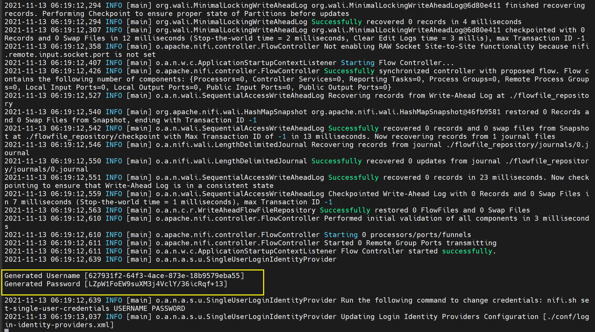
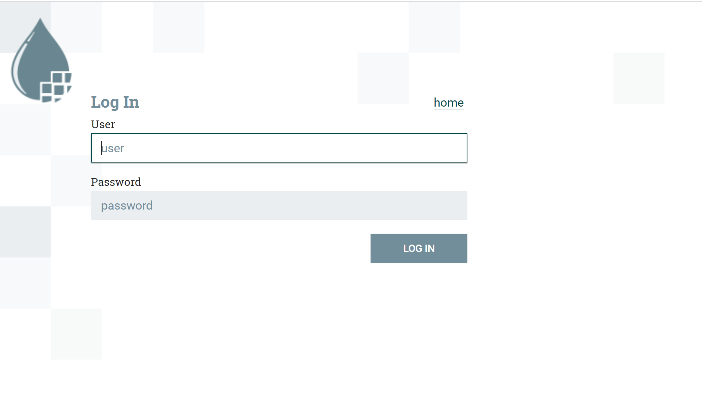
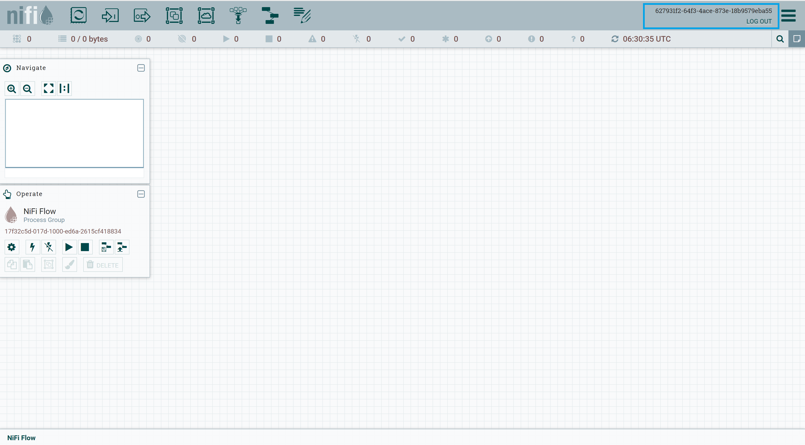

# Running NiFI securely

By default, NiFi runs securely (from 1.14.0 onwards) with single sign-on username/password credentials as authentication mechanism.

#### Download tarball from Apache NiFi site

```shell
wget https://archive.apache.org/dist/nifi/1.21.0/nifi-1.21.0-bin.zip
unzip nifi-1.21.0-bin.zip
mv nifi-1.21.0 nifi
cd nifi

# start nifi
./bin/nifi.sh start
```

`Note:` We are not required to make any nifi.properties changes as it is auto-fills required properties to run as HTTPS

#### Get username/password credentials

When to tail `nifi-app.log` file, you see randomly generated credentials which you need to use while logging into NiFi

```shell
tail -f ./logs/nifi-app.log

# username/password
# Generated Username [627931f2-64f3-4ace-873e-18b9579eba55]
# Generated Password [LZpW1FoEW9suXM3j4VclY/36icRqf+13]
```



#### Navigate to canvas

`https://<ip-address>:8443/nifi`

Enter username/password credentials and get into canvas






**Note :** If you would like to override the auto generated username/password, then execute below command

```shell
# change directory to nifi/bin
cd nifi/bin

# Replace USERNAME and PASSWORD
./nifi.sh set-single-user-credentials USERNAME PASSWORD
```