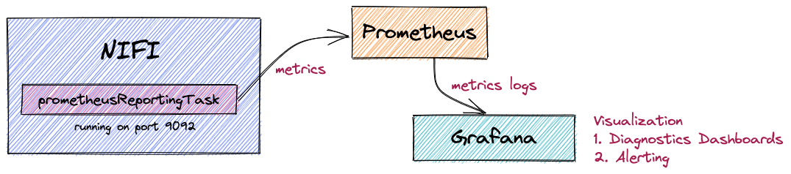

# External Monitoring with Grafana/Prometheus

NiFi natively integrates with Prometheus with the help of PrometheusReportingTask. Through PrometheusReportingTask component, we can expose NiFi system and component diagnostics to Prometheus and thereafter visualizing it with Grafana



### Stack overview

* NiFi
* Prometheus
* Grafana

## Prerequisites
* Install [Docker](https://www.docker.com/)
* Install [Docker Compose](https://docs.docker.com/compose/install/)

## Deploy ecosystem stack

Step 1: Clone the repository and checkout usecase

```shell
$ > git clone https://github.com/naddym/nifi-course-abm.git
$ > cd monitoring
```

Step 2: Deploy stack with docker-compose

```shell
$ > sudo docker-compose up
```

## Navigating to the instances

NiFi - https://localhost:8080/nifi

Grafana - https://localhost:3000

