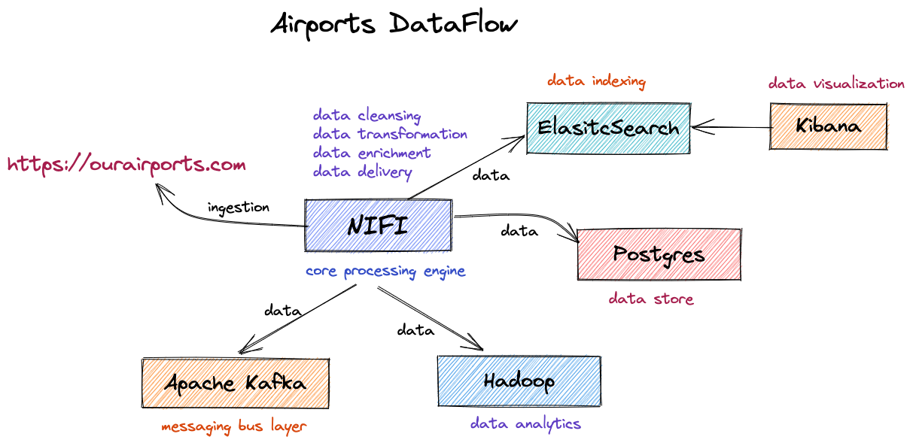

        _    _                       _         ____        _        _____ _               
       / \  (_)_ __ _ __   ___  _ __| |_ ___  |  _ \  __ _| |_ __ _|  ___| | _____      __
      / _ \ | | '__| '_ \ / _ \| '__| __/ __| | | | |/ _` | __/ _` | |_  | |/ _ \ \ /\ / /
     / ___ \| | |  | |_) | (_) | |  | |_\__ \ | |_| | (_| | || (_| |  _| | | (_) \ V  V / 
    /_/   \_\_|_|  | .__/ \___/|_|   \__|___/ |____/ \__,_|\__\__,_|_|   |_|\___/ \_/\_/  
                   |_|                                                                    

# Airports Dataflow Usecase

A complex nifi dataflow which can pull data from `ourairports.com`, performs data (transformation/enrichment/filtering) and routes to appropriate destinations such as Hadoop, Kafka, Postgres, Elasticsearch ( for data insights & visualization in Kibana ).





### Stack overview

* NiFi
* Zookeeper
* Kafka
* Hadoop
* Postgres
* Elasticsearch
* Kibana

## Prerequisites
* Install [Docker](https://www.docker.com/)
* Install [Docker Compose](https://docs.docker.com/compose/install/)

## Deploy ecosystem stack

Step 1: Clone the repository and checkout usecase

```shell
$ > git clone https://github.com/naddym/nifi-course.git
$ > cd usecase
```

Step 2: Deploy stack with docker-compose

```shell
$ > sudo docker-compose up
```

## Pre-requesite changes to Containers

Following changes are needed by dataflow to store airports data.

### Hadoop

Get into Hadoop's namenode container and execute following commands

```shell
$ > sudo docker exec -it namenode bash

# listing existing files in hadoop
$ > hdfs dfs -ls /

# creating /user/nifi directory for storing airports data
$ > hdfs dfs -mkdir -p /user/nifi
```

### Postgres DB

Get into Postgres container and execute following commands

```shell
$ > sudo docker exec -it postgres bash

# connecting to postgres
$ > psql -U postgres

# creating table airports for storing finalized data from nifi
$ > CREATE TABLE AIRPORTS (
    ID INT PRIMARY KEY NOT NULL,
    IDENT TEXT NOT NULL,
    TYPE TEXT NOT NULL,
    NAME TEXT NOT NULL,
    LATITUDE_DEG DECIMAL,
    LONGITUDE_DEG DECIMAL,
    ELEVATION_FT INT,
    CONTINENT TEXT,
    ISO_COUNTRY TEXT,
    ISO_REGISON TEXT,
    MUNICIPALITY TEXT,
    SCHEDULED_SERVICE TEXT,
    GPS_CODE TEXT,
    IATA_CODE TEXT,
    LOCAL_CODE TEXT,
    HOME_LINK TEXT,
    KEYWORDS TEXT,
    FREQUENCY_MHZ TEXT
);
```

### Template
Download `Airports_Dataflow.xml` file and upload as template into NiFi instance and run the dataflow. If you want to follow along step by step with instructor then navigate to `Configuring Processors and Controller Services` section 

### Configuring Processors and Controller Services

***GenerateFlowFile*** 

To build the dataflow, we temporarily employ sample data that will be expected from `ourairports.com`. However, in production this will be replace by directly invoking `ourairports.com`

Configuring `GenerateFlowFile` processor is simple. Just copy below data to `Custom Text` property of GenerateFlowFile Processor

```json
[
    {
        "id": 40814,
        "ident": "SK-377",
        "type": "small_airport",
        "name": "Barbosa Airport",
        "latitude_deg": 5.943333,
        "longitude_deg": -73.611389,
        "elevation_ft": 5176,
        "continent": "SA",
        "iso_country": "CO",
        "iso_region": "CO-SAN",
        "municipality": "Barbosa",
        "scheduled_service": "no",
        "gps_code": null,
        "iata_code": null,
        "local_code": "BSA",
        "home_link": null,
        "wikipedia_link": null,
        "keywords": null
    },
    {
        "id": 342103,
        "ident": "ZYXW",
        "type": "closed",
        "name": "Mt Logan Airstrip",
        "latitude_deg": 60.79299,
        "longitude_deg": -138.694027,
        "elevation_ft": 1997,
        "continent": "NA",
        "iso_country": "CA",
        "iso_region": "CA-YT",
        "municipality": "Unorganized Yukon",
        "scheduled_service": "no",
        "gps_code": "ZYXW",
        "iata_code": "ZYA",
        "local_code": "YK90",
        "home_link": null,
        "wikipedia_link": null,
        "keywords": null
    },
    {
        "id": 317861,
        "ident": "ZYYK",
        "type": "medium_airport",
        "name": "Yingkou Lanqi Airport",
        "latitude_deg": 40.542524,
        "longitude_deg": 122.3586,
        "elevation_ft": null,
        "continent": "AS",
        "iso_country": "CN",
        "iso_region": "CN-21",
        "municipality": "Laobian, Yingkou",
        "scheduled_service": "yes",
        "gps_code": "ZYYK",
        "iata_code": "YKH",
        "local_code": null,
        "home_link": null,
        "wikipedia_link": "https://en.wikipedia.org/wiki/Yingkou_Lanqi_Airport",
        "keywords": null
    },
    {
        "id": 6099,
        "ident": "SKAR",
        "type": "medium_airport",
        "name": "El Eden Airport",
        "latitude_deg": 4.45278,
        "longitude_deg": -75.7664,
        "elevation_ft": 3990,
        "continent": "SA",
        "iso_country": "CO",
        "iso_region": "CO-QUI",
        "municipality": "Armenia",
        "scheduled_service": "yes",
        "gps_code": "SKAR",
        "iata_code": "AXM",
        "local_code": "AXM",
        "home_link": null,
        "wikipedia_link": "https://en.wikipedia.org/wiki/El_Ed%C3%A9n_Airport",
        "keywords": null
    }
]
```

***InvokeHTTP***

| Name | Value |
| ---- | ----- |
| HTTP Method | `GET` |
| Remote URL | `https://davidmegginson.github.io/ourairports-data/airports.csv` |


***ConvertRecord***

| Name | Value |
| ---- | ----- |
| Record Reader | `Create a new CSVReader Controller Service` |
| Record Writer | `Create a new JsonRecordWriter Controller Service` |

***CSVReader*** Controller Service

No additional configuration is required, just enable the controller service

***JsonRecordWriter*** Controller Service

No additional configuration is required, just enable the controller service

***LookupRecord*** (Region.csv lookup )

| Name | Value |
| ---- | ----- |
| Record Reader | `Create a new JsonTreeReader Controller Service` |
| Record Writer | `Create a new JsonRecordWriter Controller Service` |
| Lookup Service | `Create a new SimpleCsvFileLookupService Controller Service with named 'Region_SimpleCsvFileLookupService'` |
| Result RecordPath | `/iso_region` |

Dynamic Properties

| Name | Value |
| ---- | ----- |
| `key` | `/iso_region` |

***SimpleCsvFileLookupService*** Controller Service (`Region_SimpleCsvFileLookupService`)

| Name | Value |
| ---- | ----- |
| CSV File | `/opt/nifi/nifi-current/datasets/regions.csv` |
| Lookup Key Column | `code` |
| Lookup Value Column | `name` |


***LookupRecord*** (frequencies.csv lookup )

| Name | Value |
| ---- | ----- |
| Record Reader | `Use same JsonTreeReader Controller Service created from 'LookupRecord' for Region.csv` |
| Record Writer | `Create a new JsonRecordWriter Controller Service named 'Frequency_JsonRecordWriter'` |
| Lookup Service | `Create a new SimpleCsvFileLookupService Controller Service with named 'Frequencies_SimpleCsvFileLookupService'` |
| Result RecordPath | `/frequency_mhz` |

Dynamic Properties

| Name | Value |
| ---- | ----- |
| `key` | `/id` |

***JsonRecordWriter*** Controller Service (`Frequency_JsonRecordWriter`)

| Name | Value |
| ---- | ----- |
| Schema Access Strategy | `Use 'Schema Text' Property` |
| Schema Text | {<br>  "type": "record",<br>  "name": "nifiRecord",<br>  "namespace": "org.apache.nifi",<br>  "fields": [<br>    {<br>      "name": "id",<br>      "type": [<br>        "null",<br>        "int"<br>      ]<br>    },<br>    {<br>      "name": "ident",<br>      "type": [<br>        "null",<br>        "string"<br>      ]<br>    },<br>    {<br>      "name": "type",<br>      "type": [<br>        "null",<br>        "string"<br>      ]<br>    },<br>    {<br>      "name": "name",<br>      "type": [<br>        "null",<br>        "string"<br>      ]<br>    },<br>    {<br>      "name": "latitude_deg",<br>      "type": [<br>        "null",<br>        "double"<br>      ]<br>    },<br>    {<br>      "name": "longitude_deg",<br>      "type": [<br>        "null",<br>        "double"<br>      ]<br>    },<br>    {<br>      "name": "elevation_ft",<br>      "type": [<br>        "null",<br>        "int"<br>      ]<br>    },<br>    {<br>      "name": "continent",<br>      "type": [<br>        "null",<br>        "string"<br>      ]<br>    },<br>    {<br>      "name": "iso_country",<br>      "type": [<br>        "null",<br>        "string"<br>      ]<br>    },<br>    {<br>      "name": "iso_region",<br>      "type": [<br>        "null",<br>        "string"<br>      ]<br>    },<br>    {<br>      "name": "municipality",<br>      "type": [<br>        "null",<br>        "string"<br>      ]<br>    },<br>    {<br>      "name": "scheduled_service",<br>      "type": [<br>        "null",<br>        "string"<br>      ]<br>    },<br>    {<br>      "name": "gps_code",<br>      "type": [<br>        "null",<br>        "string"<br>      ]<br>    },<br>    {<br>      "name": "iata_code",<br>      "type": [<br>        "null",<br>        "string"<br>      ]<br>    },<br>    {<br>      "name": "local_code",<br>      "type": [<br>        "null",<br>        "string"<br>      ]<br>    },<br>    {<br>      "name": "home_link",<br>      "type": [<br>        "null",<br>        "string"<br>      ]<br>    },<br>    {<br>      "name": "wikipedia_link",<br>      "type": [<br>        "null",<br>        "string"<br>      ]<br>    },<br>    {<br>      "name": "keywords",<br>      "type": [<br>        "null",<br>        "string"<br>      ]<br>    },<br>    {<br>      "name": "frequency_mhz",<br>      "type": [<br>        "null",<br>        "string"<br>      ]<br>    }<br>  ]<br>} |

***SimpleCsvFileLookupService*** Controller Service (`Frequency_SimpleCsvFileLookupService`)

| Name | Value |
| ---- | ----- |
| CSV File | `/opt/nifi/nifi-current/datasets/airport-frequencies.csv` |
| Lookup Key Column | `airport_ref` |
| Lookup Value Column | `frequency_mhz` |


***PutDatabaseRecord***

| Name | Value |
| ---- | ----- |
| Record Reader | `Use same JsonTreeReader Controller Service created from 'LookupRecord' for Region.csv` |
| Database Type | `PostgreSQL` |
| Statement Type | `INSERT` |
| Database Connection Pooling Service | `Create a new DBCPConnectionPool Controller Service` |
| Table Name | `airports` |

***DBCPConnectionPool*** Controller Service

| Name | Value |
| ---- | ----- |
| Database Connection URL | `jdbc:postgresql://postgres:5432/postgres` |
| Database Driver Class Name | `org.postgresql.Driver` |
| Database Driver Location(s) | `/opt/nifi/nifi-current/postgresql-42.2.2.jar` |
| Database User | `postgres` |
| Password | `postgres` |


***PartitionRecord***

| Name | Value |
| ---- | ----- |
| Record Reader | `Use same JsonTreeReader Controller Service created from 'LookupRecord' for Region.csv` |
| Record Writer | `Use same JsonRecordSetWriter Controller Service created from 'LookupRecord' for Region.csv` |

Dynamic Properties

| Name | Value |
| ---- | ----- |
| type | `/type` |

***PublishKafkaRecord_2_6***

| Name | Value |
| ---- | ----- |
| Kafka Brokers | `kafka:9093` |
| Topic Name | `${type}` |
| Record Reader | `Use same JsonTreeReader Controller Service created from 'LookupRecord' for Region.csv` |
| Record Writer | `Use same JsonRecordSetWriter Controller Service created from 'LookupRecord' for Region.csv` |
| Delivery Guarantee | `Guarantee Replicated Delivery` |
| Security Protocol | `SASL_PLAINTEXT` |
| SASL Mechanism | `PLAIN` |
| Username | `admin` |
| Password | `admin-secret` |

***PutElasticsearchHttpRecord***

| Name | Value |
| ---- | ----- |
| Elasticsearch URL | `http://elasticsearch:9200` |
| Record Reader | `Use same JsonTreeReader Controller Service created from 'LookupRecord' for Region.csv` |
| Index | `airports_dataflow` |
| Type | `_doc` |


***UpdateAttribute***

Dynamic Properties

| Name | Value |
| ---- | ----- |
| `filename` | `${now():format('dd-MMM-yyyy'):append('_'):append(${type})}` |


***PutHDFS***

| Name | Value |
| ---- | ----- |
| Hadoop Configuration Resources | `/opt/nifi/nifi-current/conf/core-site.xml` |
| Directory | `/user/nifi` |

***RouteOnAttribute***

Dynamic Properties

| Name | Value |
| ---- | ----- |
| `closed` | `${type:equals('closed')}` |